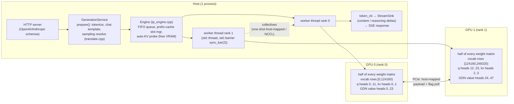
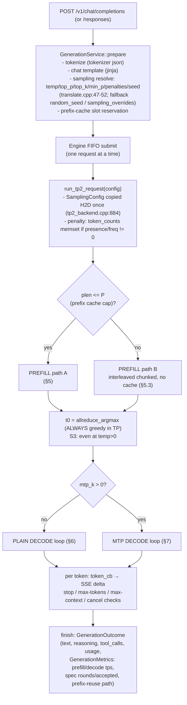
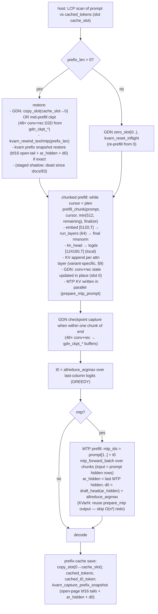
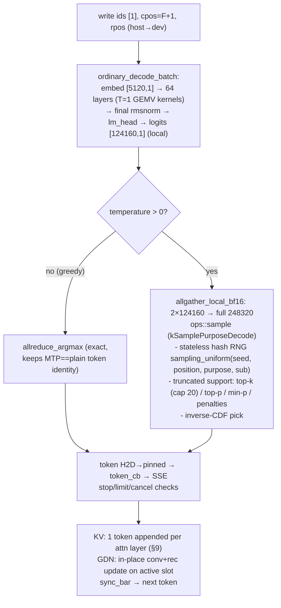

# 102 — System pipeline map: request enter → exit, prefill / decode / MTP, all KV caches, hardware-specific code

**Status:** reference map, built from source on 2026-08-28 (worktree `wo-kvarn-hold`, commit `257832b7` + uncommitted D-22 classifier).
**Scope:** the complete path a request takes through `ninfer` on 2× RTX 5060 Ti (TP2), for qwen3_6_27b — plain decode and MTP, greedy and sampled, for every KV-cache variant. Includes a hardware-specificity audit (everything that assumes the current silicon) for the planned RTX 5000-series rollout.
**Companions:** docs/82 (KVarN GEMM-on-codes), docs/83 (code-space kernel + wall removal), docs/101 (D-22/D-23 work order), repo/docs/41 (TC-P handoff).

---

## 1. Top level



Two rank threads run **the same loop in lockstep** (`run_tp2_request`, `src/runtime/tp2/tp2_backend.cpp:821`), synchronized at every step by `std::barrier sync_bar(2)` (host) and by device-side collective kernels (PCIe). There is no scheduler: one request at a time, batch=1 everywhere (decode batch API exists in TextContext, `kMaximumConcurrency=8`, but the serve path uses batch 1).

---

## 2. Model geometry (qwen3_6_27b) — the shapes that flow everywhere

| Quantity | Value | Note |
|---|---|---|
| Layers | **64** | hybrid: full attention iff `(layer+1) % 4 == 0` → layers **3,7,…,63 (16 layers)**; the other **48 are GDN** (Gated DeltaNet linear attention) |
| hidden | 5120 | residual stream width, every stage in/out |
| MLP (swiglu) | 5120 → 17408 → 5120 | quantized (Q4/W8 per variant) |
| vocab | 248320 (padded) | **ColumnN-sharded: each rank holds 124160 rows** of embed/lm_head/draft-head |
| Full attn | n_q=24, n_kv=4, head_dim=256 | per rank: **12 q, 2 kv**; rope dim 64, theta 1e7, scale 1/√256 |
| GDN | key 16×128, value 48×128, conv width 4 (state 3) | per rank: **8 key, 24 value heads**; conv dim 2·2048+6144=10240 (5120/rank); recurrent state FP32 [128,128] per value head |
| MTP head | 1 layer, input rows = embed‖hidden = 10240 | separate KV pool (1 layer, 2 kv heads/rank); **draft head**: small linear 5120 → 124160 (local), Q4G64 or W8G32 (`launch_draft_head`, tp2_backend.cpp:716) |
| Paged KV page | 64 tokens (`kPagedKVPageSize`) | all variants |
| Ring capacity | `max(max_context, kv_capacity) + mtp_k + 4` tokens | paged pool sized at startup (tp2_backend.cpp:~290) |
| Prefill chunk | `min(512, max_context)` | tp2_backend.cpp:433 |

Per-layer, per-rank weight split for the attention layer: QKV projection emits local q [256,12,T] + gate [256,12,T] + k [256,2,T] + v [256,2,T]; o_proj is **RowK-split** (each rank computes a partial 5120-vector, fused allreduce+residual add, `attn_mix_tp`, text_context_impl.h:1288). GDN: control projections replicated on both ranks, value/key head blocks partitioned (`gdn_mix_tp`, :1355).

---

## 3. Request lifecycle, enter → exit



Notes:
- **t0 (first generated token) is always argmax-greedy in TP mode**, because the fused `allreduce_argmax` is the only exact cross-rank combine for the ColumnN-sharded logits (temp>0 needs the allgather, which prefill doesn't do — S3 comment, tp2_backend.cpp:1462-1471).
- Prefix-reuse paths (logged in metrics): `FullReset`, `RestoreResponseCheckpoint` (GDN slot copy + KVarN rewind), `RestoreTurnCheckpoint` (mid-prefill GDN checkpoint buffer).

---

## 4. What each rank owns (TP2 layout)

| Tensor | rank 0 | rank 1 |
|---|---|---|
| embed / lm_head / draft-head rows | [0, 124160) | [124160, 248320) |
| Q heads (24) | 0–11 | 12–23 |
| KV heads (4) | 0–1 | 2–3 |
| GDN value heads (48) | 0–23 | 24–47 |
| GDN conv (10240 ch) | 0–5119 | 5120–10239 |
| KV cache pages (all variants) | 2 kv heads' worth per page | 2 kv heads' worth per page |
| GDN state (48 layers) | its 24 value heads per layer | its 24 value heads per layer |
| MTP layer weights | half | half |

Collectives (`src/core/multi_gpu/tp_group.cpp`):
- **one-shot allreduce** (`OneShotAllReduce`, ≤65536 elements = 128 KiB): GPU writes a host-mapped payload, polls the peer's host flag over PCIe (`cudaHostAllocMapped`, `st/ld.global.cv` PTX), sums in a small kernel. 128 rotating slots. **TP=2 only** (`if (I.n == 2)`, tp_group.cpp:109).
- **one-shot argmax** (`OneShotArgmax`, ≤8 tokens): each rank argmaxes its local half, exchanges (value, global-index) payload, both write the global argmax. **Read-only on the logits.**
- **NCCL** for anything larger (e.g. the plain-decode temp>0 allgather = 248 KiB).
- Host orchestration: `std::barrier sync_bar(2)` between every step.

---

## 5. Prefill

### 5.1 Path A — short prompt (plen ≤ P), with prefix-cache handling



Key buffers: `cached_ph` [5120, prefix_cap] (prompt hidden rows for MTP input), `prefill_dummy` (same shape, scratch), `mtp_ph`/`mtp_mh` views over them.

### 5.2 Per-layer step inside prefill (one of 64)

- **Full attention** (`attn_mix` / `attn_mix_tp`, text_context_impl.h:1209/1288):
  1. rmsnorm → h [5120,T]
  2. QKV GEMM (quantized) → q/gate [256·n_q_local,T], k/v [256·n_kv_local,T]
  3. per-head rmsnorm (q_norm, k_norm)
  4. rope (rotary_dim 64) on qn, kn
  5. **attention (variant-specific, §9)** → a [256·n_q_local,T]
  6. sigmoid·gate, o_proj RowK + allreduce + residual
- **GDN** (`gdn_mix` / `gdn_mix_tp`, :1355/1526): in_proj → conv1d (width 4, state 3) → gating (β/g) → delta-net recurrent update → out_proj + residual. State lives in the GDN pool (§10). Chunked-prefill kernels (`src/ops/linear_attention/gated_delta_net/chunked/`) process T>1; the **output phase grid is tuned to a 5090** (`kTargetCtas = 170×4`, §13).

### 5.3 Path B — long prompt (plen > P)

Same chunked loop, but no prefix restore/save, GDN slots zeroed, and the MTP prefill runs interleaved in the same chunk loop (so MTP KV is built with O(n·chunk) work, not a second O(n²) pass).

---

## 6. Plain decode (mtp_k = 0)



Per-token cost ≈ 64 × (GEMV + variant-attention + GDN), with one collective per split layer (o_proj residual for the 16 attn layers, MLP row-split for all 64 — each ≤128 KiB so one-shot) plus the final argmax/allgather. This is the path the decode_guard GB gate measures (≥69 t/s @40k/250k packed-only).

---

## 7. MTP speculative decode (mtp_k = k, e.g. 3)

State: `cur_anchor` (t0), `cur_F` = plen (D-21 fix: t0 belongs at position plen), `cur_slot` = 0, draft buffer `d0..d_{k-1}`.

```mermaid
sequenceDiagram
  participant TP as tp2 loop (both ranks)
  participant T as target (64 layers)
  participant D as MTP head (1 layer) + draft_head
  participant A as accept kernel
  TP->>TP: (1) verify_ids=[anchor,d0..d{k-1}], pos F..F+k (speculative_prepare_verify_inputs)
  TP->>T: (2) target_verify_batch: embed [5120,k+1] → 64 layers width k+1
  Note over T: GDN snapshot: state after col j → slot j (initial=cur_slot, base=0)\nKV: all k+1 columns appended (variant-specific)
  T-->>TP: verify_hidden [5120,k+1], verify_logits [124160,k+1] (LOCAL half)
  TP->>TP: (3) allreduce_argmax → target_tokens [k+1] (GLOBAL)
  TP->>A: (4) speculative_accept_greedy_drafts (token_domain=124160, sample_cfg)
  Note over A: greedy: a = longest prefix where target_tokens[i]==drafts[i];\nt_star = target_tokens[a]; licensed[0..a]=[d0..d{a-1}, t_star]\nsampling: rejection sampling over LOCAL half-vocab logits\n(see D-22: half-vocab + DRAFT_OUTSIDE_LOCAL)
  A-->>TP: accepted=a, licensed[0..a]
  TP->>TP: (5) REBASE: cur_anchor=lic[a]; cur_F=F+a+1; cur_slot=a\nkvarn_rewind_text/mtp(next_F)  (discard rejected-draft KV from in-flight tiles)
  TP->>TP: (6) mtp_prepare_next_round (alignment ids, rope deltas, budget)
  TP->>D: (7) mtp_forward_decode_batch(alignment_ids, verify_hidden as packed input)\n→ alignment_hidden [5120,k+1]
  TP->>D: (8) ar_hidden = alignment_hidden[:, a]  (select_accepted_hidden)
  TP->>D: (9) d0 = draft_head(ar_hidden) [124160,1] → allreduce_argmax (draft-vocab remap → global)
  TP->>D: (10) d1..d{k-1}: sequential mtp_forward_decode_batch(prev_tok, prev_hid)\n→ draft_head → argmax each
  TP->>TP: (11) optional ngram lookup override (find_context_lookup_drafts)
  TP->>TP: token_cb(licensed, a+1); stats; sync_bar → next round
```

Acceptance semantics (speculative_round.cuh): greedy branch `accepted = a`, `produced = a+1` (the +1 is the correction/bonus token t_star, which becomes next round's anchor). GDN needs no rebase copy — the slot ring already holds "state after col j" in slot j; `cur_slot = a` selects it. The KV cache DOES need a rewind because the verify batch appended KV for all k+1 columns including rejected drafts.

Draft quality gate (llama.cpp parity reference, docs/101 §2.3): llama.cpp stops drafting when top-1 confidence < `p_min`; this system always proposes all k drafts.

---

## 8. GDN linear-attention state pool (the "state cache")

`src/core/linear_attention_state.h` + `DecoderStateSpec` (tp2_backend.cpp:~300):

- 48 layers × per layer: **conv** [5120 ch/rank × width 3] + **recurrent** [128×128 × 24 heads/rank] FP32 (≈1.5 MiB/layer/rank).
- **Slots**: `slot_count = 2k+2` (k=3 → 8). Slots 0..k: verify-column snapshots (col j → slot j); slot `2k+1`: **prefix-cache slot** (committed prefill state). `copy_slot`/`zero_slot`/`recurrent_slot`/`conv_slot` ops.
- Plain decode: in-place update of the active slot. MTP verify: snapshot semantics (each col reads from `initial+j`, writes to `base+j`, base=0).
- Prefix restore: `copy_slot(cache_slot→0)` or per-layer D2D from the mid-prefill checkpoint buffer (48× conv + 48× rec captured near end of prefill, §5.1).
- This pool is why a "KV cache" is really two caches here: paged KV (16 attn layers + 1 MTP) + GDN state (48 layers). Prefix reuse must restore **both**, and the snapshot point must be consistent (`snap.token_count`).

---

## 9. KV-cache variants — how each behaves differently

All variants: paged, 64-token pages, per layer per rank. The variant is chosen at startup (`--kv-cache`) and **selects the attention algorithm**, not just the storage dtype.

| | **BF16** (shadow/reference) | **I8** (Int8Group64) | **KVarN K4V2** (code space) |
|---|---|---|---|
| Page contents (per layer, per rank, **2 kv heads**) | K [256,64] + V [256,64] bf16 per head = **128 KiB** | K/V int8 [256,64] per head + group-64 scales (≈64 KiB) | per head: K codes [256,64] 4-bit = 8 KiB + V codes [64,256] 2-bit = 4 KiB + scales [1152] fp32 = 4.5 KiB; ×2 heads ≈ **33 KiB** (≈3.9× smaller; 4+2 bit codes + ≈1.1 bit/element scale metadata vs 16-bit) |
| Scale plane | — | k_scale/v_scale pages | `kvarn_scale_pages [2 heads, pages, 1152]` fp32 (per-tile: K per-channel scale+zp [256] + per-token [64]; V per-token scale+zp [64] + per-channel [256]; + FWHT/Sinkhorn log terms) |
| Write path | `gqa_kv_append` (direct paged append, exact) | `gqa_kv_append` (quantize on write, exact enough) | `gqa_kv_append_kvarn_and_commit`: new K/V (bf16) → in-flight tile k_tile [256,64]/v_tile [64,256] bf16 → at 64 tokens: **RTN quantize in FWHT code space + log-domain Sinkhorn variance normalization → packed page (lossy)** |
| Read path (decode T=1) | flash over paged bf16 (`gqa_attention`, SmallT/ChunkedSmallT routes) | int8 dequant + `mma.sync m16n8k32 s8` / SIMT | **`gqa_attention_kvarn_decode_packed_kernel`**: codes read directly, dequant-in-smem, QK + PV via `mma.sync m16n8k16 bf16`, **deferred V-FWHT epilogue** (docs/82 A2: codes decode to H(V)/16; PV accumulates H(acc_true)/256; epilogue un-rotates), partials (pm,pl,pa) → merge kernel. Grid `(kv_heads=2, token_blocks, splits=54)` = 108 CTAs = **3 full waves on 36 SMs**; 99 KiB smem → 1 block/SM |
| Read path (prefill) | bf16 flash (Prompt route) | bf16 flash after dequant | materialize packed→bf16 (`gqa_kvarn_materialize_kernel`, O(n²) pass) then bf16 flash |
| Two-regime behavior | none | none | **staged shadow existed** (in-wall: bf16 flash over materialized shadow; beyond-wall: packed). **docs/83 removed the wall: `stage_pages=0` always** (tp2_backend.cpp:439-446) — every KVarN decode is packed now. Dead-but-present code paths remain (`has_staged`, `NINFER_KVARN_NO_SHADOW`). |
| Prefix-cache extras | exact open page, nothing special | same | **open tile commit is lossy** → `kvarn_capture_prefix_snapshot` saves bf16 open-page tails + MTP seed (ar_hidden, d0) at prefill end; restored on hit (`kvarn_restore_prefix_snapshot`, D-16) |
| Numerics | reference | ~1 ulp | lossy round-trip per page; per-page (64-token) commit boundary changes numerics; acceptance/determinism differ (D-22 history, D-23) |

**Why "every KV cache performs differently" here but not in llama.cpp/vLLM:** in llama.cpp/vLLM the KV dtype is a storage detail — one attention kernel reads whatever dtype and dequantizes in-register; all backends produce near-identical numerics and differ only in bandwidth. Here:
1. The variant **selects a different algorithm** (KVarN attention is FWHT code-space math with a deferred-rotation epilogue, not softmax-over-dequant).
2. KVarN has **write-time lossiness at 64-token page boundaries** (the open tile is encoded lossily on commit; decode may read the tile pre- or post-commit depending on position).
3. KVarN decode **crosses regime boundaries** in history (staged shadow vs packed — now removed, but the materialize-on-prefill + packed-on-decode split remains) and has **T=1 vs T>1 routing** (docs/83 option B: query tokens blocked so each CTA stays within the 16-row MMA tile).
4. Prefix reuse is variant-specific (bf16 open pages are exact; KVarN needs the snapshot/restore dance).
5. So per-variant acceptance rates, determinism, and t/s all differ — that is expected behavior of the design, and it is why D-22/D-23 must be diagnosed per-variant (docs/101 §2.2 classification).

MTP KV is a **separate pool** (`mtp_kv`, 1 layer, same variant) with its own workspace, tail, and prefix-snapshot half.

---

## 10. Sampling system

- **Stateless hash RNG** `sampling_uniform(seed, position, purpose, sub)` (`src/ops/kernel/sampling_device.cuh:62`, splitmix64-based): same (seed, position, purpose, sub) → same u, forever; safe under CUDA-graph replay; no state to corrupt. Seed wired `translate.cpp:47-52` → `tp2_backend.cpp:884` (`host_cfg.seed = req.sampling.seed`) → device `SamplingConfig` per request.
- Purposes: Prefill=0, **Decode=1**, **SpeculativeAccept=2**, SpeculativeCorrection=3, SpeculativeBonus=4.
- Truncation: `sampling_build_truncated_*` → top-k (cap `kSamplerCandidateCap=20`), top-p, min-p, penalties (token_counts H2D buffer, zeroed at request start when penalties≠0); `sampling_normalize_support` (softmax w/ temp, renorm); `sampling_pick_from_support` (inverse CDF, can exclude a rejected draft token → residual correction).
- **Plain decode temp>0**: full 248320 distribution (allgathered) — exact.
- **MTP accept temp>0**: operates on the **rank-local 124160-row logits only** (`token_domain=124160`, tp2_backend.cpp:1675) — the other half of the vocab has zero probability, and global draft ids ≥124160 are never found in the local scan (`pd=0` → always rejected, "DRAFT_OUTSIDE_LOCAL", ~1/32 columns measured). **This is the D-22 suspect cluster** (docs/101 §2.4; `results/d22_accept_instrumentation_findings.md`: greedy 67.9% acceptance = drafts align with global argmax; MTP temp 1 output = garbage = off-distribution correction/bonus tokens; plain temp 1 = coherent).

---

## 11. Determinism & identity properties

- Greedy: `allreduce_argmax` is exact (max over halves, tie-break by global index) → MTP greedy == plain greedy token-for-token (invariant protected by S1/S2 and the D-21 closure).
- Sampling: plain temp>0 exact vs full distribution; MTP temp>0 NOT exact (half-vocab, §10) — known open defect D-22.
- KVarN: lossy per page → byte-identity across builds only guaranteed for bf16; A/B greps are the gate at routing changes (docs/78/83 convention).

---

## 12. Where request data lives on the GPU (per rank)

| Arena | Size | Contents |
|---|---|---|
| `persistent` (WorkspaceArena) | 256 MiB initial, grows | decoder state spec (KV pools + GDN pool), cached_ph/prefill_dummy [5120, prefix_cap], GDN checkpoint buffers (48× conv+rec), round state (verify/alignment/draft buffers, draft head, draft vocab, token_counts [248320]), KVarN workspaces (in-flight tiles, prefix snapshot) |
| `staging` | 32 MiB | small per-step H2D/D2H scratch (ids, positions, anchors, pinned accept results) |
| model weights | ~8 GiB (Q4/W8 mix, per rank; 17 GB model dir total on disk) | sharded as §4 |

---

## 13. Hardware-specific code audit (RTX 5060 Ti today → RTX 5000 series)

### 13.1 Build gate
- **`CMakeLists.txt:7-12`**: hard-enforces `CMAKE_CUDA_ARCHITECTURES=120a`, rejects anything else. All RTX 50-series is sm_120 (5060/5060Ti/5070/5070Ti/5080/5090), so the flag itself rolls forward — but every constant below must be re-examined per SKU.

### 13.2 5060-Ti (36 SM) tuning — will be WRONG on other SKUs
| Location | Constant | Effect on other SKUs |
|---|---|---|
| `src/ops/kernel/gqa_attention_kvarn.cuh:827` | `kKvarnDecodeSplits = 54` — "2×54=108 blocks = 3 full waves on 36 SMs" | 5070 (60 SM): 1.8 waves; 5080 (84): 1.3; 5090 (170): 0.64 — **severely under-parallelized**; needs per-SKU split count (or runtime SM-count query) |
| `src/ops/launcher/gqa_attention_kvarn.cu:182-189` | packed kernel: 99 KiB smem, 1 block/SM | OK on all sm_120 (128 KiB/SM); on sm_100/B-series (228 KiB) the 1-block/SM design wastes the SM |
| `src/ops/kernel/gqa_attention_kvarn.cuh:438` | `kKvarnDecodeGroupMax = 8` — "keeps smem ≤ ~90 KiB (sm_120a)" | sm_120 smem cap, fine across the 50 series |

### 13.3 5090 (170 SM) tuning — present in tree, NOT tuned for the 5060 Ti we run on
| Location | Constant |
|---|---|
| `src/ops/launcher/rope.cu:16-17` | `kLargeBlockWaveCapacity = 1020` = 170 SM × 6 CTAs/SM (256-thread CTAs) |
| `src/ops/launcher/gqa_attention_decode.cu:53-58` | "Bc=64 is one CTA/SM… keep the 8K grid at or below one 170-SM wave"; I8 T=6 large-window split clamp `kMax = 42 × DecodeSplitScale` |
| `src/ops/linear_attention/gated_delta_net/chunked/output.cu:9-11` | `kRtx5090SmCount = 170`, `kCtasPerSm = 4` → `kTargetCtas = 680` (GDN chunked prefill output phase) |
| `src/ops/sparse_moe/prefill/sparse_moe_prefill_kernels.cu:256-258` | `kRtx5090SmCount = 170`, `kPrefillBlocksPerSm = 3` → 510 persistent blocks (MoE prefill; not in the dense 27B path but in-tree) |

→ On the 5060 Ti these grids are <1 wave (harmless, just untuned). On a 5090 the 36-SM KVarN decode constant is the problem. **The two tuning targets coexist in one tree** — a per-SKU dispatch table is the fix.

### 13.4 Interconnect assumptions (PCIe, TP=2, host-mapped)
- **One-shot collectives** (`one_shot_allreduce.cu`, `one_shot_argmax.cu`): `cudaHostAllocMapped` payloads + **device-side polling of peer host flags over PCIe** (`st.global.wt` / `ld.global.cv` PTX, `__nanosleep(10)` loop). Designed for PCIe Gen5 x16 (~63 GB/s each way). On NVLink-equipped systems (or a future 4-GPU config) the host-bounce is a pessimization vs direct P2P.
- **TP=2 only**: `if (I.n == 2)` (tp_group.cpp:109); `attn_mix_tp`/`gdn_mix_tp` divide by world=2; all payloads are 2-rank; `std::barrier(2)`. A 5090 build will likely run TP=2 too, but 4-GPU (2×5090×2) would need a real rework.
- **No P2P-GPU-memory path exists** — all rank traffic is either host-mapped bounce (small) or NCCL (large).

### 13.5 Memory / VRAM
- Auto-KV **is** VRAM-portable (`tp_engine.cpp:301-336` probes free VRAM, `max_context_fitting`).
- But the **model half needs ~8 GiB** of weights (17 GB on-disk dir / 2, plus KV/state) → 8 GiB (5060) cannot host it at TP2; 12 GiB (5070) is marginal at small context; **5080 (16 GiB) is the comfortable minimum viable SKU**; 5090 (32 GiB) auto-KV gets much larger context.
- Per-rank arenas (256 MiB persistent + 32 MiB staging, tp2_backend.cpp:45) are sized for the workload, not the card.
- **Memory bandwidth is the dominant decode metric and varies 4.7× across the series** (5060 Ti GDDR7 128-bit ≈ 448 GB/s → 5090 512-bit ≈ 1792 GB/s). Every gate in docs/78/83 (G1 ≥150 GB/s effective packed-code read, GB gate ≥69 t/s @40k/250k) was measured on the 5060 Ti and must be re-baselined per SKU; kernel tuning (waves, smem, vector widths) will move.

### 13.6 Instruction-set / feature assumptions
- `mma.sync.aligned.m16n8k16 bf16` (sm_89+), `m16n8k32 s8` (sm_80+), `kind::f8f6f4 e4m3` (sm_89+), `kind::mxf4nvf4` block-scale (sm_100+; compiled for 120a, verify per SKU) — all in `src/ops/common/mma.cuh`.
- `cp.async` (sm_80+) prefetch everywhere; **TMA `cp.async.bulk.tensor`** only in `src/ops/linear/nvfp4/nvfp4_w4a4_tma.cuh` (not in the current model path).
- `__CUDA_ARCH__` guards: only 3 occurrences (nanosleep compat, ≥700) — no hidden per-arch code paths.
- No hardcoded SM counts except the constants in §13.2/13.3; no device-property queries in the compute path (`device.cu` queries props but only request_log consumes them).

### 13.7 Rollout checklist (per new SKU)
1. Re-derive: KVarN decode splits (waves), rope wave capacity, GDN output `kTargetCtas`, MoE persistent blocks, I8 split clamps — ideally from a runtime `multiProcessorCount` query instead of constants.
2. Re-baseline G1/GB gates at the SKU's bandwidth.
3. Verify mxf4nvf4 + TMA availability.
4. If NVLink (not expected in consumer) — replace one-shot host-bounce with P2P.
5. VRAM: auto-KV handles context; verify weight fit (≥16 GiB/card).

---

## 14. Open defects that this map explains (context for docs/101)

- **D-22 (MTP sampling acceptance collapse)**: §10 half-vocab accept + DRAFT_OUTSIDE_LOCAL; greedy path unaffected (exact argmax). Instrumentation: `NINFER_D22_PDBG` (per-column p(argmax), p(draft), outside-local flag).
- **D-23 (S3 seed divergence, plain decode, KVarN)**: §9 per-variant numerics — the only place where the KV variant changes decode output; discriminators in docs/101 §3.1.
- **Per-variant behavior spread** (acceptance 47%→2.4%→13%→9% history, t/s 63→28→37→33): expected given §9, but the deltas that crossed *build* boundaries (not just variant) are the bugs.
