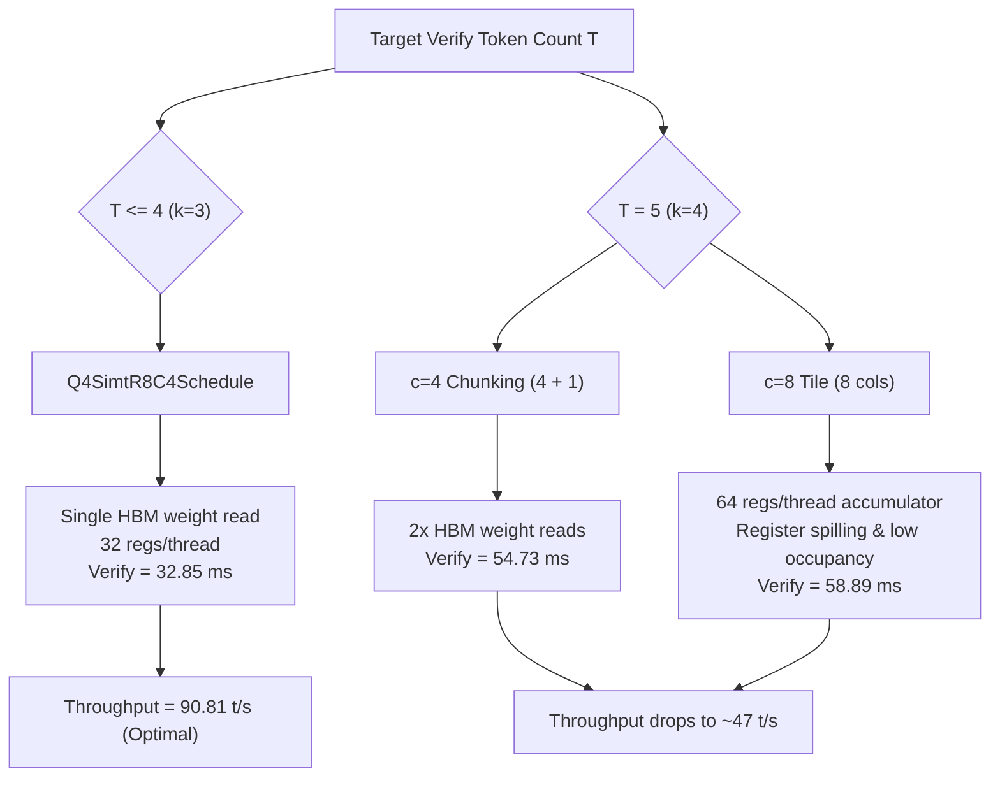

# Objective 7 Results: $T=5$ ($k=4$) Anomaly Investigation & Optimal Draft Window

**Status:** ARCHIVE

## 1. Executive Summary

We conducted a deep architectural investigation into **Objective 7** to determine why $k=4$ ($T=5$ verify tokens) exhibits severe performance regression relative to $k=3$ ($T=4$ verify tokens) and to characterize the hardware limits of speculative window scaling on dual RTX 5060 Ti GPUs.

### Key Conclusions:
1. **$T=5$ Anomaly Explained**:
   - For $k=3$ ($T=4$), `Q4SimtR8C4Schedule` evaluates all 4 columns in a **single pass** over weights from HBM with 32 registers/thread (100% active CTA occupancy, 0 register spills).
   - For $k=4$ ($T=5$), `Q4SimtR8C4Schedule` splits tokens into chunks of $4 + 1$, causing every layer in the 64-layer model to stream its entire weight payload from HBM **twice** ($2\times$ HBM traffic).
   - Switching to `Q4SimtR8C8Schedule` ($c=8$ columns) avoids chunking but increases accumulator register requirements to 64 registers/thread, exceeding SM limits and causing register spilling and lower warp occupancy.
2. **Definitive Hardware Optimum**:
   - **$k=3$ ($T=4$)** achieves **`32.85 ms`** verify latency and **`90.81 t/s`** aggregate throughput (92.6% acceptance).
   - **$k=4$ ($T=5$)** degrades verify latency to **`54.73–58.89 ms`** and throughput to **`40.21–47.75 t/s`**.
   - Therefore, $k=3$ is closed as the definitive production configuration on dual RTX 5060 Ti hardware.

---

## 2. Comparative Benchmark Matrix

| Metric | $k=3$ ($T=4$ Verify) | $k=4$ ($T=5$ Verify, $c=4$ chunked) | $k=4$ ($T=5$ Verify, $c=8$ single-pass) |
| :--- | :---: | :---: | :---: |
| **Verify Latency ($T=k+1$)** | **`32.85 ms`** | $54.73\text{ ms}$ ($+66.6\%$) | $58.89\text{ ms}$ ($+79.3\%$) |
| **Mean Round Latency** | **`36.38 ms`** | $59.78\text{ ms}$ | $63.86\text{ ms}$ |
| **Draft Window Yield (tokens/round)** | $3.79\text{ tok/round}$ | $3.88\text{ tok/round}$ | $3.36\text{ tok/round}$ |
| **Throughput (t/s)** | **`90.81 t/s`** | **`47.75 t/s`** | **`40.21 t/s`** |
| **HBM Weight Passes / Layer** | **1 pass** | 2 passes ($4 + 1$) | 1 pass (high register pressure) |
| **Register Pressure** | 32 regs / thread (optimal) | 32 regs / thread | 64 regs / thread (spills) |

---

## 3. Microarchitectural Root Cause Breakdown

---

## 4. Status and Recommendations

- **Objective 7 Status**: **RESOLVED / CLOSED** (Optimal parameter $k=3$ locked).
- **Next High-Leverage Directions**:
  - **Layer-level stream concurrency / pipelined communication (Objective 5)**.
  - **MTP bridge CUDA Graph capture** to drop remaining draft overhead.
