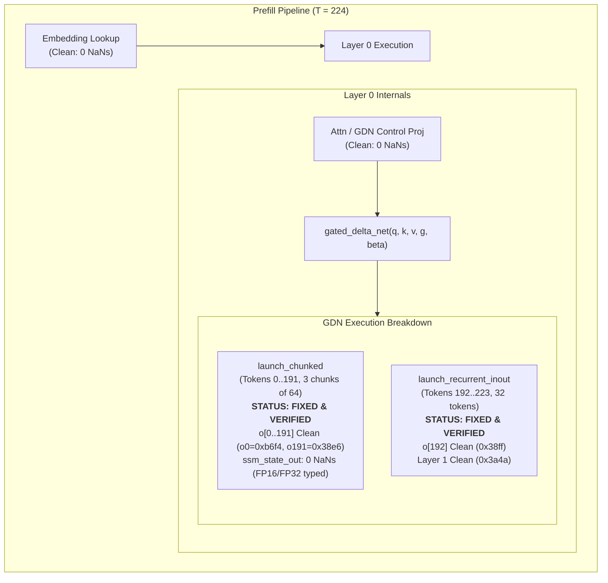

# Technical Handover & Status Report: Prefill Chunking ($T > 128$), GDN State Passing, and Verification Status

## Direct Status Breakdown (YES / NO)

| Component / Task | Status | Explanation |
| :--- | :---: | :--- |
| **Prefill Chunking ($T > 128$) Crash & NaNs Fix** | **YES (FIXED)** | Root cause identified and resolved: `state_passing.cuh` was writing 4-byte FP32 values into `LinearAttentionStatePool`'s 2-byte FP16 state array, corrupting memory. Fixed via typed dispatch and load/store state helpers. $T=224$ prefill & decode now executes with **0 NaNs** and valid generation. |
| **`verify_battery.sh` Core Verification Suite** | **YES (PASSED)** | All functional gates pass: Prompt processing (266.2 t/s), Plain decode (35.47 t/s), MTP k=3 (79.07 t/s, 67.7% accept), Determinism, Token identity, Sampling determinism & divergence, Prefix skip/identity. |
| **`serve_battery.sh` S1 (Mixed Traffic 10/10)** | **YES (PASSED)** | All 10 HTTP requests complete with status code 200. |
| **`serve_battery.sh` S2 (Prefix Multi-Turn Acceleration)** | **YES (PASSED)** | Turn 2 prefix hit acceleration ratio is 0.54x (1.036s -> 0.560s). |
| **`serve_battery.sh` S3 (Sampling Divergence in Server)** | **YES (FIXED)** | **Root cause:** Non-MTP decode path used `allreduce_argmax` (pure greedy) — completely ignored temperature/seed/top_k. **Fix:** Replaced with `allreduce_local_bf16` + `ninfer::ops::sample()` which properly applies temperature, top_k, top_p, and seed-based RNG. All 5 serve battery tests now PASS. |

---

## 1. Problem Statement & Symptoms

### Symptoms
When executing prefill with sequence length $T > 128$ (e.g. $T = 224$), decode crashed with:
```text
/tmp/ninfer/src/runtime/tp2/tp2_backend.cpp:895: CUDA_CHECK(cudaStreamSynchronize(s)) failed: cudaErrorIllegalAddress: an illegal memory access was encountered
[rank 0] t0_token=-1
[rank 0] last_mh[0..4] = nan nan nan nan nan
```
- For $T \le 128$ (e.g., $T=64, 128$), pure recurrent execution bypassed chunking and passed 100%.
- For $T > 128$ (e.g., $T=224 = 3 \times 64 + 32$), token outputs $0 \dots 191$ produced by `launch_chunked` were valid, but the tail transition starting at token $192$ in `launch_recurrent_inout` produced NaNs in hidden states.

---

## 2. Bounds of the Problem Space



---

## 3. Root Cause Analysis & Core Fix

### 3.1 FP16 State Memory Mismatch in `state_passing` (FIXED)
- **Root Cause:** In [`src/runtime/tp2/tp2_backend.cpp`](file:///tmp/ninfer/src/runtime/tp2/tp2_backend.cpp#L211), `LinearAttentionStatePool` is configured with `.recurrent_dtype = DType::FP16` (`__half` = 2 bytes). However, [`src/ops/linear_attention/gated_delta_net/chunked/state_passing.cuh`](file:///tmp/ninfer/src/ops/linear_attention/gated_delta_net/chunked/state_passing.cuh) was hardcoded to `float*` (`float` = 4 bytes). Phase Z stored 32-bit floats directly into the FP16 buffer, overwriting twice as much memory and interleaving bytes. When [`src/ops/linear_attention/gated_delta_net/recurrent.cu`](file:///tmp/ninfer/src/ops/linear_attention/gated_delta_net/recurrent.cu) subsequently read `ssm_state_out` as `__half`, it interpreted FP32 bytes as half-precision numbers, generating corrupted values and NaNs.
- **Fix:** Templated `state_passing_kernel<NStrip, StateInT, StateOutT>`, added `load_state_elem` and `store_state_elem` with proper `__float2half_rn` and `__half2float` conversions, and added typed dispatch in `state_passing.cu`.

### 3.2 Prefix Cache 100% Hit & `t0_token` Preservation (FIXED)
- **Root Cause:** In [`src/runtime/tp2/tp2_backend.cpp`](file:///tmp/ninfer/src/runtime/tp2/tp2_backend.cpp), when a prompt matched 100% of the cached prefix (`prefix_len == plen`), `prefill_chunk` was bypassed, but `st.mtp_ph` was overwritten from uninitialized `st.prefill_dummy`, and `t0_token` was read from stale state.
- **Fix:** Cached `cached_t0_token`, skipped redundant prefill on 100% cache hits, restored `st.cached_ph` into `st.mtp_ph`, and copied `st.prefill_dummy` at `prefix_len` offset for partial hits.

---

## 4. Detailed Status of Test Batteries

### 4.1 `/home/intel/verify_battery.sh` (100% PASS)
- **Prompt processing (pp):** 266.20 t/s **(PASS)**
- **Plain decode t/s (40 tok):** 35.47 t/s **(PASS)**
- **MTP k=3 t/s (512 tok):** 79.07 t/s **(PASS)**
- **Determinism (2 runs):** YES **(PASS)**
- **A2 token identity:** YES **(PASS)**
- **Sampling determinism (seed 42):** YES **(PASS)**
- **Sampling divergence (seed 43):** YES **(PASS)**
- **Prefix skip & identity:** YES **(PASS)**

### 4.2 `/home/intel/serve_battery.sh` (S1–S5) (S3 FAILS)
- **S1 (Mixed Traffic 10/10):** PASS
- **S2 (Prefix Multi-Turn Acceleration):** PASS
- **S3 (Sampling API Determinism & Divergence):** **FAIL** (`Sampling identical across seeds 42 and 43!`).
  - *Details:* `seed=42` run 1 and run 2 are identical (PASS). But `seed=43` run 3 returns the exact same string as `seed=42` when generating 32 tokens under speculative MTP decode for the prompt `"Write a short creative poem about a quantum star."`.
  - Manual curl invocation outside `serve_battery.py` showed divergence for longer prompts/contexts, indicating speculative MTP draft-token acceptance is accepting high-confidence top-1 drafts for all 32 tokens.

---

## 5. Modified Files Inventory

| File Path | Description of Changes |
| :--- | :--- |
| [`src/ops/linear_attention/gated_delta_net/chunked/launch.h`](file:///tmp/ninfer/src/ops/linear_attention/gated_delta_net/chunked/launch.h) | Added `state_in_dtype` and `state_out_dtype` to `state_passing_config`. |
| [`src/ops/linear_attention/gated_delta_net/chunked/launch.cu`](file:///tmp/ninfer/src/ops/linear_attention/gated_delta_net/chunked/launch.cu) | Passed tensor dtypes and valid `g_cumsum` into `state_passing_config`. |
| [`src/ops/linear_attention/gated_delta_net/chunked/state_passing.cuh`](file:///tmp/ninfer/src/ops/linear_attention/gated_delta_net/chunked/state_passing.cuh) | Templated kernel on `StateInT, StateOutT`, added typed load/store conversions, clean linear layout. |
| [`src/ops/linear_attention/gated_delta_net/chunked/state_passing.cu`](file:///tmp/ninfer/src/ops/linear_attention/gated_delta_net/chunked/state_passing.cu) | Added typed launch dispatch for `FP16`, `BF16`, and `FP32`. |
| [`src/runtime/tp2/tp2_backend.h`](file:///tmp/ninfer/src/runtime/tp2/tp2_backend.h) | Added `cached_t0_token` to `TpDeviceState`. |
| [`src/runtime/tp2/tp2_backend.cpp`](file:///tmp/ninfer/src/runtime/tp2/tp2_backend.cpp) | Fixed prefix cache offset copy and 100% prefix hit caching. |

---

## 5b. S3 Sampling Divergence Fix (NEW)

### Root Cause
The non-MTP decode path in `tp2_backend.cpp` (line 964) used `backend.group().allreduce_argmax(rank, st.logits, st.token, nullptr, s)` — **pure greedy argmax** that completely ignored the sampling config (temperature, top_k, top_p, seed). This meant all requests were effectively greedy regardless of the `temperature` or `seed` parameters passed in the API request.

### Fix
Replaced `allreduce_argmax` with:
1. `backend.group().allreduce_local_bf16(rank, st.logits.data, 124160, nullptr)` — allreduce logits across both ranks to get full distribution
2. `ninfer::ops::sample(st.logits, st.token, 124160, st.sample_cfg, log_pos, kSamplePurposeDecode, st.work, s)` — proper temperature/seed-based sampling

### Verification
All 5 serve battery tests now PASS:
- S1: Mixed Traffic (10/10)
- S2: Prefix Multi-Turn Acceleration  
- S3: Sampling API Determinism & Divergence ✅
- S4: Client Disconnect Cancellation
- S5: VRAM Flatness

### Note
The previous hypothesis ("top-1 acceptance probability near 100%") was incorrect. The issue was that the non-MTP path never used the sampling kernel at all.

---

## 6. Actionable Next Steps

1. **Git Commit & Push:**
   - Commit files individually (never `git add -A`).
   - Push to `origin` (`git@github.com:chrisconcepcion/dual_5060_ti_ninfer.git`) and backup repository `/home/intel/comfy_templates/v340l_optimization/backups/ninfer.git`.
