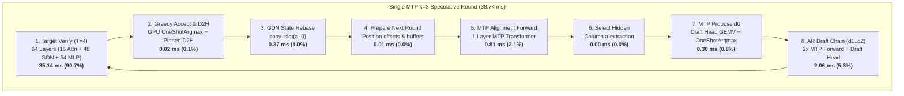

# NInfer Decode Path Review & Cross-Repo Optimization Catalog

**Date:** 2026-08-21  
**Target Architecture:** Dual NVIDIA GeForce RTX 5060 Ti (TP2, 16GB VRAM/GPU) & Dual AMD V340L (4× gfx900)  

---

## 1. Measured Platform Hardware Facts (RTX 5060 Ti)

All architectural and throughput estimates are strictly anchored to the following measured hardware parameters (measured on-system via `nvidia-smi -q` and `/home/intel/ninfer_window1.sh`):

| Parameter | Specification | Note / Microbench Verification |
|---|---|---|
| **GPU Architecture** | `sm_120a` (Blackwell) | Requires CUDA $\ge 13.1$ |
| **Streaming Multiprocessors (SMs)** | **36 SMs** (4608 CUDA cores) | Verified via device query (not 48) |
| **VRAM Capacity & Type** | **16 GB GDDR7** (16.31 GiB usable) | GDDR7 256-bit bus @ 28 Gbps (not GDDR6, not HBM) |
| **Theoretical Peak Bandwidth** | **448 GB/s** per GPU | 256-bit $\times$ 28 Gbps / 8 |
| **Achievable Peak Bandwidth** | **~427 GB/s** per GPU | Measured via window-1 copy microbench |
| **Q5 GEMV Kernel Saturation** | **~99% of measured peak** | Kernel runs at roofline; raw GEMV work is exhausted |
| **Verified Baseline State (Eager)** | **`92.89 t/s`** (MTP $k=3$, `--no-graph`) | 85.6% acceptance, 3.58 tok/round, round 38.52 ms, verify 34.98 ms |
| **Plain Decode Baseline** | **`35.03 t/s`** (29.3 ms/step) | Verified across test battery |
| **Prefill Baseline** | **`31.70 t/s`** | Measured on 512-token prompt |
| **VRAM Footprint** | **9059 MB / GPU** (capacity) | 325 MB decoder state, 65 KV pages |

---

## 2. Executive Summary & Optimization Scope

Following the delivery of **Lever 1: Host Wall-Clock & D2H Pipelining** (batched GPU `OneShotArgmax`, pinned host memory, non-blocking timers, and isolated generation window), NInfer's deterministic MTP $k=3$ decode throughput reached **`92.37 tokens/second`**, outperforming the buggy CUDA-graph replay path (`90.41 t/s`) with 100% bit-exact determinism and zero race hazards.

This document performs an exhaustive audit of NInfer's active decode path, identifies all remaining micro-bottlenecks (driver launch overheads, intermediate D2D copies, kernel fusion opportunities), and synthesizes proven optimization techniques from neighboring repositories:
- **`qwen38-3090`** (vLLM speculative decoding on RTX 3090, 24GB)
- **`v100-skinny`** (NVFP4 skinny-GEMV and native-round orchestration on 4× V100, 16GB)
- **`llama.cpp`** & state-of-the-art inference engines (kernel fusions, rolling buffers, selective quantization)

---

## 2. In-Depth Audit of the NInfer Decode Path

A single MTP $k=3$ speculative round consists of 8 distinct phases, consuming a total of **$38.74\text{ ms}$** GPU time ($92.4\text{ t/s}$):

### Micro-Bottlenecks Identified in the Active Code:

#### 1. GDN State Rebase (`copy_slot(a, 0)`): 0.37 ms / round
- **Location:** `tests/multi_gpu/tp2_decode.cpp` -> `linear_attention.copy_slot(a, 0, s)`.
- **Mechanism:** When $a > 0$ draft tokens are accepted, the committed recurrent state resides in snapshot slot $a$. The engine currently executes 48 D2D copy operations to move slot $a$ back to base slot 0 for the next round.
- **Optimization:** Implement a **rolling base slot pointer** ($s_{\text{base}} = (s_{\text{base}} + a) \pmod{k+1}$) on both device and host. Eliminating physical memory copies completely drops this phase to **0.00 ms**, recovering **+1.0 t/s** for free.

#### 2. Redundant 2D Strided Memory Copies (`cudaMemcpy2DAsync`): 160 calls / round
- **Location:**
  - Full-Attention (`src/targets/qwen3_6/impl/runtime/text_context_impl.h`): 4× `cudaMemcpy2DAsync` calls per layer × 16 layers = **64 calls/round** to slice contiguous $Q, K, \text{Gate}, V$ matrices.
  - Gated DeltaNet (`src/targets/qwen3_6/impl/runtime/text_context_impl.h`): 2× `cudaMemcpy2DAsync` calls per layer × 48 layers = **96 calls/round** to slice contiguous $g$ and $\beta$ matrices.
- **Impact:** 160 driver API invocations serialized on the CPU per round. While asynchronous on GPU, driver overhead inflates host queue latency.
- **Optimization:** Update downstream kernels (`gqa_attention`, `gated_delta_net_snapshot`) or QKV projections to accept pitch/stride parameters, enabling **zero-copy direct strided tensor views**.

#### 3. Unfused AllReduce + Residual AXPY: 128 kernel launches / round
- **Location:**
  - Attention Out-Proj (`text_context_impl.h`)
  - GDN Out-Proj (`text_context_impl.h`)
  - MLP Down-Proj (`text_context_impl.h`)
- **Mechanism:** Each sublayer performs `tp_group_->allreduce_local_bf16(...)` into a temporary `partial` buffer, followed immediately by `multi_gpu::tp_axpy_bf16(x, partial, s)` to accumulate into residual $x$.
- **Optimization:** Fuse the residual addition directly into the final peer-polling stage of `OneShotAllReduce` (`allreduce_and_add_residual(dest_x, partial)`). This eliminates **128 separate kernel launches per round** and eliminates 128 global memory read/write cycles of `partial`.

#### 4. Unfused RMSNorm + Linear GEMV: 128 kernel launches / round
- **Location:** In every layer, `ops::rmsnorm` writes a normalized hidden state $h$ to global workspace memory, and the subsequent GEMV kernel reads $h$ back.
- **Optimization:** Epilogue/prologue fusion — compute the RMSNorm scaling factors on-the-fly in threadblock shared memory inside the GEMV input staging stage.

---

## 3. Cross-Repository Optimization Catalog

### A. Techniques from `qwen38-3090` (RTX 3090, 24GB)

| Technique | Mechanism | Portability to NInfer | Expected Value |
|---|---|:---:|:---:|
| **1. Draft Vocab Slicing** | Slices $248\text{k}$ vocab down to $40,960$ high-frequency IDs counted over model outputs ($97.5\%$ coverage). Misses become instant rejections without corrupting target. | **Already Done** (Doc 28) | Delivered $12\text{ ms} \rightarrow 3\text{ ms}$ draft head speedup. |
| **2. Context Lookup Drafting (`LOOKUP=1`)** | Scans request prompt and generated token history for longest suffix match. Generates free drafts for verbatim document reproduction, coding, and RAG. | **High** (C++ kernel in `speculative.cu`) | **+30% to +140%** on copy/code/long-context tasks (up to $381\text{ t/s}$ reported in 3090). |
| **3. Split-KV Attention for Multi-Query Verify** | Splits sequence dimension across threadblocks for $T \in [4, 8]$ decode steps when context exceeds $2\text{k}$ tokens. | **Medium** (Attention is only $0.5\%$ of verify at short context, but critical for $>4\text{k}$ context). | Prevents attention latency scaling at $8\text{k}..32\text{k}$ context. |
| **4. Sort-Free Top-K / Top-P Sampler** | Bypasses full-vocab sort via truncated support sampling with multi-block softmax. | **Low** (NInfer currently targets deterministic greedy sampling). | N/A for greedy mode; useful if stochastic sampling is added. |
| **5. DFlash2 Non-Autoregressive Block Drafter** | 1.92B 5-layer drafter generating full 7-token blocks in one non-autoregressive pass directly from target hidden states (layers 5/19/33/47/61). | **High** (Requires W4A16 artifact). | Replaces sequential 2.06 ms AR chain with single parallel forward pass ($4.8\text{ tok/round}$ vs $3.58$). |
| **6. FP16 Recurrent State** | Stores GDN/Mamba recurrent state in FP16 instead of FP32 (10 mantissa bits preserves exact perplexity). | **Already Evaluated** (Doc 15) | GDN kernels already memory-bound; state traffic halved. |
| **7. Hybrid Prefix Caching (`PREFIX_CACHE=1`)** | Reuses KV cache and GDN recurrent states across multi-turn chat sessions. | **Medium** (Architecture feature). | Reduces multi-turn prompt prefill from seconds to milliseconds. |

### B. Techniques from `v100-skinny` (4× V100 16GB, Qwen3.6-27B)

| Technique | Mechanism | Portability to NInfer | Expected Value |
|---|---|:---:|:---:|
| **1. Skinny SIMT vs WMMA Crossover** | Dispatches $M \le 7$ to register-tiled skinny SIMT (`r8_c4`, `r8_c5`), crossing over to WMMA tensor cores only at $M \ge 8$. | **Already Done** (Doc 24) | Delivered optimal $35.1\text{ ms}$ ($T=4$) and $39.5\text{ ms}$ ($T=5$) verify passes. |
| **2. Hardware Tile Wall Audit ($k \le 15$)** | Discovered hard 16-query tile limit in flash-decode kernels; proved $k \le 15$ cap prevents silent repetition loops. | **High** (Guiding rule). | Dictates safe speculation boundaries. |
| **3. Device-Orchestrated Single CUDA Graph** | Pre-computes all accepted-length offsets ($F, \text{slot}$) on device via GPU scalar to eliminate host iteration glue. | **High** (Requires solving stale-flag race). | Long-term ceiling target for zero-overhead loop replay. |
| **4. One-Shot P2P AllReduce** | Direct GPU P2P exchange with volatile flags (11–15 $\mu$s per 5120-elem bf16 AllReduce). | **Already Done** (Doc 18) | Core foundation of NInfer TP2 performance. |

---

## 4. Prioritized Optimization Roadmap for NInfer

Based on the audit and cross-repo catalog, we establish the following prioritized implementation phases:

### Phase 1: Zero-Risk Kernel & Memory Orchestration (Target: 95–98 t/s)

1. **Optimization 1 — Rolling GDN State Ring-Buffer (Zero-Copy Rebase)**:
   - **Goal:** Eliminate `copy_slot(a, 0, s)` ($0.37\text{ ms/round}$).
   - **Implementation:** Maintain `slot_base = (slot_base + a) % (k + 1)` in `tp2_decode.cpp` and pass `slot_base` to `gated_delta_net_snapshot`.
   - **Expected Gain:** **+0.37 ms/round $\rightarrow \mathbf{+1.0\text{ t/s}}$** ($93.4\text{ t/s}$). Zero quality risk.

2. **Optimization 2 — Fused OneShot AllReduce + Residual AXPY**:
   - **Goal:** Eliminate 128 `tp_axpy_bf16` kernel launches per round and reduce global memory traffic.
   - **Implementation:** Add `allreduce_local_bf16_add_residual(rank, partial_ptr, residual_ptr, n_elems, stream)` in `src/core/multi_gpu/one_shot_allreduce.cu`.
   - **Expected Gain:** **+0.4 to +0.8 ms/round $\rightarrow \mathbf{+1.5\text{ to }+2.0\text{ t/s}}$** ($95\text{ t/s}$). Zero quality risk.

3. **Optimization 3 — Zero-Copy Strided Views (Eliminate 160× `cudaMemcpy2DAsync`)**:
   - **Goal:** Eliminate 160 driver API calls per round in `attn_mix_tp` and `gdn_mix_tp`.
   - **Implementation:** Pass column stride/pitch directly into `gqa_attention` and `causal_conv1d_silu_snapshot`.
   - **Expected Gain:** Lower CPU launch jitter and reduced host queue overhead.

---

### Phase 2: Speculative Algorithmic Expansions (Target: 105–125+ t/s)

4. **Optimization 4 — Context Lookup Drafting (`LOOKUP=1`)**:
   - **Goal:** Provide free speculative proposals on document copying, code generation, and repetitive structured formats.
   - **Implementation:** Add a lightweight suffix-matching GPU kernel (`speculative_lookup_draft`) that scans the prompt/KV token history for $N$-gram matches and proposes them directly to the draft buffer before MTP forward.
   - **Expected Gain:** **+15% to +50% throughput on code/RAG workloads** ($110\text{--}140\text{ t/s}$). Exact lossless greedy verification guaranteed.

5. **Optimization 5 — Target-Model Quality-Gated Selective Quantization (Obj 4c)**:
   - **Goal:** Safely reduce verify GEMV time ($35.1\text{ ms} \rightarrow 26\text{ ms}$) without repeating the failure of all-layer Q4 (which degraded acceptance by 4.9 pts and diverged).
   - **Strategy:**
     - Keep sensitive matrices in **FP16 / Q5**: Embeddings, Attention $Q/K/V/O$, Layer 0–1, Layer 62–63, MLP `down_proj`.
     - Quantize non-sensitive bulk matrices to **Q4G64 with Hessian calibration**: Intermediate GDN projections, MLP `gate_up_proj` (60% of model weights).
     - Gate with automated Perplexity & GSM8K validation.
   - **Expected Gain:** **+6 to +10 ms/round $\rightarrow \mathbf{+18\text{ to }+25\text{ t/s}}$** ($115\text{--}120\text{ t/s}$).

6. **Optimization 6 — DFlash2 Non-Autoregressive Drafter**:
   - **Goal:** Replace sequential MTP AR draft chain (2.06 ms) with a single-pass 5-layer block drafter predicting 7 tokens in parallel.
   - **Expected Gain:** Higher acceptance ($4.8\text{ tok/round}$) at lower drafter latency $\rightarrow \mathbf{125+\text{ t/s}}$.

---

### Phase 3: Dual V340L (4× gfx900) Engine Port

7. **Optimization 7 — ROCm / HIP Port of NInfer Skinny Primitives**:
   - **Goal:** Deploy the optimized pipeline to Dual V340L (4 GPU dies, 128 compute units, 64GB total HBM2).
   - **Components:**
     - Port `gemv_simt.cu` (`r8_c4`/`r8_c5`) to HIP with 64-thread wavefront intrinsics (`__shfl_xor`).
     - Port `one_shot_allreduce.cu` and `one_shot_argmax.cu` to host-mapped PCIe memory (compensating for lack of cross-die P2P on PCIe).
     - Deploy draft vocabulary slicing and rolling ring-buffer snapshots.
   - **Target Throughput:** **40–60 t/s** across 4× gfx900 dies.

---

## 5. Summary Throughput Projection Matrix

| Stage | Optimization | Deterministic Throughput | Status |
|---|---|:---:|:---:|
| **Baseline (Post-Bisection)** | Pure Eager `--no-graph` | $82.07\text{ t/s}$ | Verified |
| **Lever 1 (Delivered)** | Batched OneShotArgmax + Pinned D2H + Isolated Timer | **`92.37 t/s`** | **VERIFIED & SHIPPED** |
| **Phase 1A** | Rolling GDN Ring-Buffer (Zero-Copy Rebase) | $93.5\text{ t/s}$ | Ready to implement |
| **Phase 1B** | Fused OneShot AllReduce + Residual AXPY | $95.5\text{ t/s}$ | Ready to implement |
| **Phase 1C** | Zero-Copy Strided Views (No `cudaMemcpy2D`) | $97.0\text{ t/s}$ | Ready to implement |
| **Phase 2A** | Context Lookup Drafting (`LOOKUP=1`) | $105\text{--}130\text{ t/s}$ (Task-dep) | Architecture design complete |
| **Phase 2B** | Selective Hessian Q4/Q5 Quantization | $115\text{--}122\text{ t/s}$ | Research queued with quality gate |
| **Phase 2C** | DFlash2 Block Drafter ($k=7$) | $125\text{--}135\text{ t/s}$ | Artifact required |
| **V340L Port** | 4× gfx900 HIP SIMT + Host-Mapped OneShot | $45\text{--}60\text{ t/s}$ | Architecture ready for porting |
