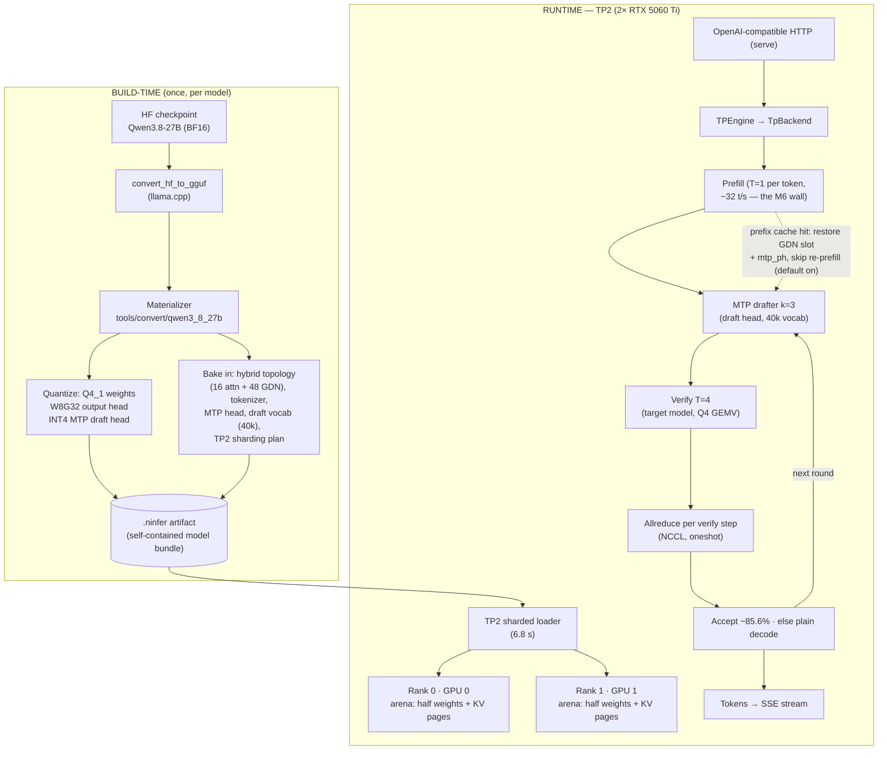
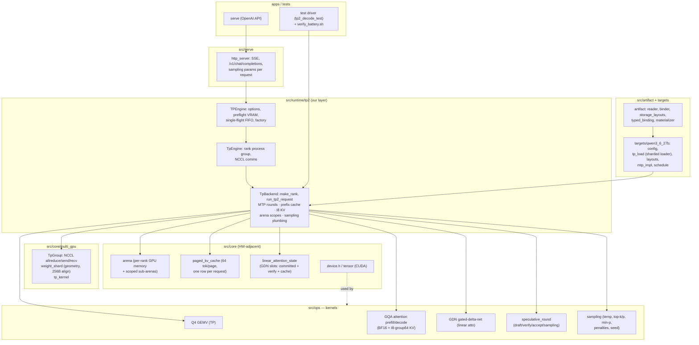
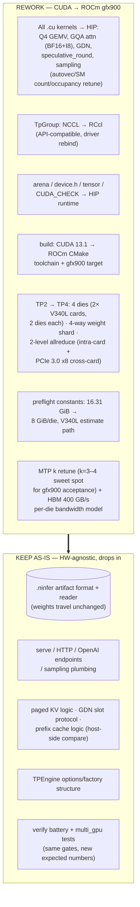

# Document 40: NInfer architecture graphs + V340L port cone (mermaid)

Date: 2026-08-21. Three graphs: pipeline, general architecture, V340L rework cone.

## 1. Pipeline — checkpoint to streamed tokens

## 2. General architecture of NInfer

## 3. V340L port — rework cone vs carry-over

**Read:** the rework cone is exactly the kernel/comm/build layer + the TP2→TP4
topology widening. Everything above it (artifact, serve, cache logic, engine
structure, test gates) is HW-agnostic and drops in unchanged. The V340L port is
"port C + retune," not "redesign."
